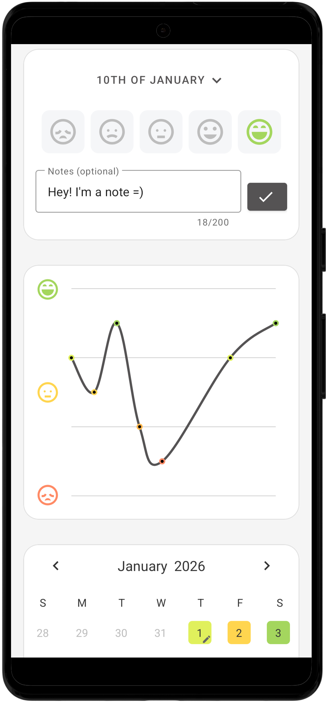
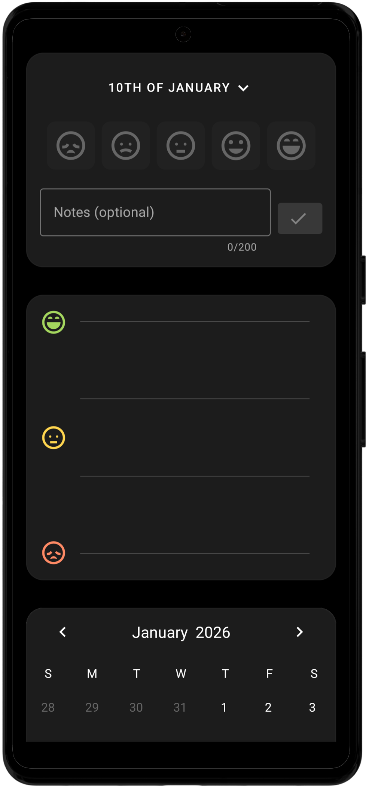
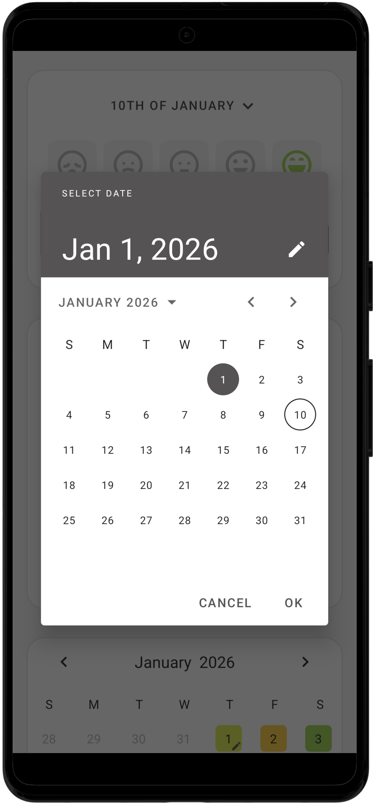
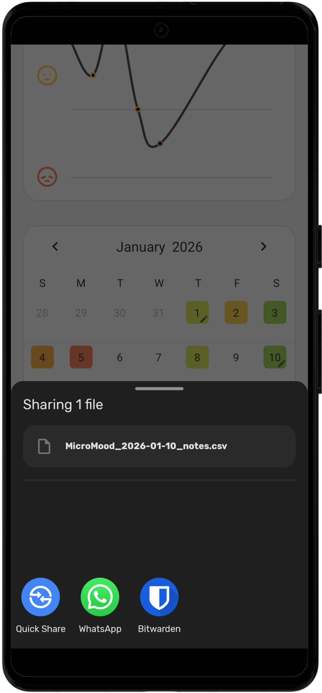
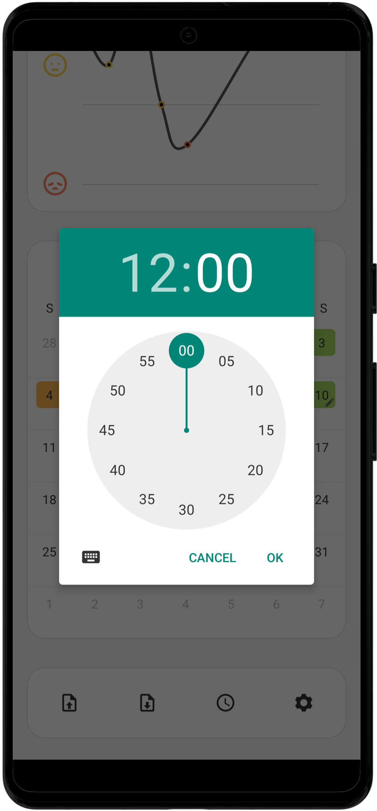

<div align="center">

# **MicroMood**

An open-source, ad-free mood tracker with micro note-taking. Minimalistic UI with full data control.

---

    

---

[](https://github.com/piquecode/MicroMood/releases)

</div>

## Features

- **Simple Mood Tracking** - Quick one-tap mood selection with optional micro-notes
- **Date Picker** - Review and log moods for any past date
- **Data Export** - Export your mood history to CSV for external analysis
- **Data Import** - Import your old mood history CSV to migrate to a new device
- **Reminder System** - Set daily reminders to maintain tracking consistency
- **Dark Mode Support** - Automatic theme switching for comfortable viewing
- **Privacy First** - All data stored locally on your device
- **No Ads, No Tracking** - Completely free and open-source
- **Material Design** - Clean, modern interface following Android design guidelines

## Installation

Download the latest APK from the [Releases](https://github.com/piquecode/MicroMood/releases) page.

## Tech Stack

- **Language:** Kotlin
- **Database:** Room (SQLite)
- **UI:** Material Design
- **Architecture:** MVVM with Coroutines

## Building from Source

1. Clone the repository
```bash
git clone https://github.com/piquecode/MicroMood.git
```

2. Open the project in Android Studio

3. Build and run on your device or emulator

## Credits

MicroMood is a fork of [MiniMoods](https://github.com/CampbellMG/MiniMoods/) by Campbell Gowing, enhanced with additional features and UI improvements.

## License

This project is licensed under the MIT License - see the [LICENSE](LICENSE) file for details.